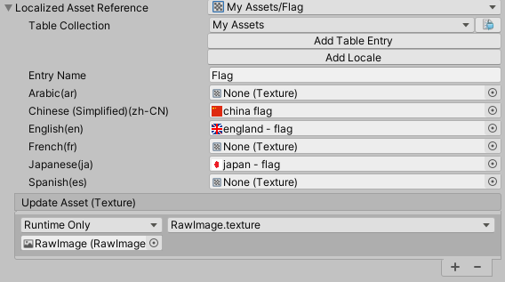

# Scripting

This documentation describes the most common ways to interact with the Localization System via C# scripts, further examples can be found in the **Scripting API** documentation.

You can download additional scripting examples from the package manager window, in the Localization package’s **Samples** section.

## LocalizedString

A [LocalizedString](xref:UnityEngine.Localization.LocalizedString) accesses specific entries from within a [String Table](StringTables.md).

You can use the [LocalizedString](xref:UnityEngine.Localization.LocalizedString) in a user script. It serializes and displays its own editor, which you can use to select the table and table entry, and edit the localized values inline, without opening the Tables window.

The [LocalizedString](xref:UnityEngine.Localization.LocalizedString) provides a [UnityEngine.Localization.LocalizedString.StringChanged](xref:UnityEngine.Localization.LocalizedString.StringChanged) event. The script calls the event whenever the selected [Locale](UnityEngine.Localization.Locale) changes. This makes your code simpler and more efficient, because the script only calls it when it needs to update the [LocalizedString](xref:UnityEngine.Localization.LocalizedString).

[!code-cs[localized-string-events](../DocCodeSamples.Tests/LocalizedStringSamples.cs#localized-string-events)]

## Dynamic Strings

Sometimes you might need to update a localized string, such as when using [Smart Strings](Smart/SmartStrings.md) or [String.Format](https://docs.microsoft.com/en-us/dotnet/api/system.string.format) with arguments that have since changed. Calling `GetLocalizedString` with the arguments always updates the string. When you use the `StringChanged` event, you can use the `RefreshString` function to request an update, and the `Arguments` property to configure the arguments that format the string.

[!code-cs[localized-string-smart](../DocCodeSamples.Tests/LocalizedStringSamples.cs#localized-string-smart)]

## LocalizedAsset

[LocalizedAsset](xref:UnityEngine.Localization.LocalizedAsset`1) is a generic class that accesses localized versions of Unity assets from within an [Asset Table](AssetTables.md).

You can use the [LocalizedAsset](xref:UnityEngine.Localization.LocalizedAsset`1) in a user script. It serializes and displays its own editor, which you can use to select the table and table entry, and edit the localized values inline, without opening the Tables window.

The [LocalizedAsset](xref:UnityEngine.Localization.LocalizedAsset`1) provides an [AssetChanged](xref:UnityEngine.Localization.LocalizedAsset`1.AssetChanged) event. The script calls the event whenever a new localized asset is available, such as when the game language changes. This makes your code simpler and more efficient, because the script only calls it when it needs to update the [LocalizedAsset](xref:UnityEngine.Localization.LocalizedAsset`1).

To use a [LocalizedAsset](xref:UnityEngine.Localization.LocalizedAsset`1), you need to create a concrete version of the class and mark it as `Serializable`.

For example, to support localizing font assets, you could define the following class:

[!code-cs[localized-font](../DocCodeSamples.Tests/LocalizedFontSample.cs)]

In this example, you can now add `LocalizedFont` to a script(LocalizedFontExample), and [LocalizedAsset](xref:UnityEngine.Localization.LocalizedAsset`1) will call the [AssetChanged](xref:UnityEngine.Localization.LocalizedAsset`1.AssetChanged) event when a localized Font asset is available.

The following Unity assets are already supported:

| **Type** | **Class** |
|----------|-----------|
| [AudioClip](https://docs.unity3d.com/ScriptReference/AudioClip.html) | [LocalizedAudioClip](xref:UnityEngine.Localization.LocalizedAudioClip) |
| [Font](https://docs.unity3d.com/ScriptReference/Font.html) | [LocalizedFont](xref:UnityEngine.Localization.LocalizedFont) |
| [GameObject/Prefab](https://docs.unity3d.com/Manual/Prefabs.html) | [LocalizedGameObject](xref:UnityEngine.Localization.LocalizedGameObject) |
| [Material](https://docs.unity3d.com/ScriptReference/Material.html) | [LocalizedMaterial](xref:UnityEngine.Localization.LocalizedMaterial) |
| [UnityEngine.Object](https://docs.unity3d.com/ScriptReference/Object.html) | [LocalizedObject](xref:UnityEngine.Localization.LocalizedObject) |
| [Sprite](https://docs.unity3d.com/ScriptReference/Sprite.html) | [LocalizedSprite](xref:UnityEngine.Localization.LocalizedSprite) |
| [Texture](https://docs.unity3d.com/ScriptReference/Texture.html) | [LocalizedTexture](xref:UnityEngine.Localization.LocalizedTexture) |
| [TMP Font](https://docs.unity3d.com/Packages/com.unity.textmeshpro@latest?subfolder=/api/TMPro.TMP_FontAsset) | [LocalizedTmpFont](xref:UnityEngine.Localization.LocalizedTmpFont) |

### TableReference

Use the [TableReference](xref:UnityEngine.Localization.Tables.TableReference) struct to reference an Asset Table or String Table. To reference a table, you can use either the table's name or its unique GUID. It is usually safer to use the GUID, because you might decide to change the table name in future, which would require you to manually update your references, but the GUID always stays the same.

### TableEntryReference

Use the [TableEntryReference](xref:UnityEngine.Localization.Tables.TableEntryReference) struct to reference an entry in an Asset Table or String Table. To reference a table, you can use either the table entry's name or its unique Key ID, an unsigned long integer. It is usually safer to use the Key ID, because you might decide to change the table entry name in future, which would require you to manually update your references, but the Key ID always stays the same.

## Using AsyncOperationHandle

Unity does not hold all localized assets in memory ready for use. Instead, it loads them on demand when it needs them, and unloads them when it no longer needs them. Because of this, localized Assets might not be immediately available, and Unity might need to load them from disk or fetch them from a server. To facilitate this, Unity uses the [AsyncOperationHandle](https://docs.unity3d.com/Packages/com.unity.addressables@latest?subfolder=/manual/AddressableAssetsAsyncOperationHandle.html) as an interface to all requests.
When an Asset is not immediately available, the localization system returns an `AsyncOperationHandle`. When the operation has finished, the `AsyncOperationHandle` provides a `Completed` event to notify Unity. It calls this during `LateUpdate`. If the request has already completed (for example, when the requested data is already loaded from a previous request, or during preloading), you can check the `IsDone` property for immediate access via the `Result` property. Alternatively, the `Completed` event still occurs in `LateUpdate`, allowing for all code to follow the same path. You can also yield on an `AsyncOperationHandle` inside a coroutine.

To force an operation to complete on the main thread, call [WaitForCompletion](https://docs.unity3d.com/Packages/com.unity.addressables@latest?subfolder=/api/UnityEngine.ResourceManagement.AsyncOperations.AsyncOperationHandle.html#UnityEngine_ResourceManagement_AsyncOperations_AsyncOperationHandle_WaitForCompletion). See [Synchronous Workflow](https://docs.unity3d.com/Packages/com.unity.addressables@latest?subfolder=/manual/SynchronousAddressables.html) for further details.

## Make a basic Locale selection menu

This example demonstrates how to create a way for the person playing a game to select the language (defined in the Localization system by Locale) they want to use in the game.
To add a UI dropdown menu to the Scene, go to **GameObject > UI > Dropdown**, and attach the following script:

[!code-cs[locale-dropdown](../DocCodeSamples.Tests/LocaleDropdown.cs#example-code)]

You can see a more advanced version of this script in the Localization package samples.

## Custom Table loading

This example demonstrates how the [ITableProvider](xref:UnityEngine.Localization.Settings.ITableProvider) can be used to provide a custom [String Table](StringTables.md) without using the [Addressables](https://docs.unity3d.com/Packages/com.unity.addressables@latest) system. This approach is particularly useful when you want to allow users to add third party content, such as modding. The localization data could be loaded from an external file and then converted into a table at runtime.

[!code-cs[update-collection](../DocCodeSamples.Tests/TableProviderSamples.cs#custom-table-provider)]

The `CustomTableProvider` can be applied to handle [String Tables](StringTables.md) or [Asset Tables](AssetTables.md):

[!code-cs[update-collection](../DocCodeSamples.Tests/TableProviderSamples.cs#set-provider-editor)]

## Applying changes to a table after the game is built

This example demonstrates how the [ITablePostprocessor](xref:UnityEngine.Localization.Settings.ITablePostprocessor) can be used to apply changes to a table after it has loaded but before it has been used. This can be beneficial when you wish to modify or add additional entries to a table, such as when supporting third party content (modding).

[!code-cs[update-collection](../DocCodeSamples.Tests/TablePatcherSamples.cs#custom-table-patcher)]

The `CustomTablePatcher` can be applied to handle [String Tables](StringTables.md) or [Asset Tables](AssetTables.md):

[!code-cs[update-collection](../DocCodeSamples.Tests/TablePatcherSamples.cs#set-patcher-editor)]

## Editor

Use the Editor scripting class [LocalizationEditorSettings](xref:UnityEditor.Localization.LocalizationEditorSettings) to make changes to Localization assets.

The following example shows how to update a collection by adding support for a new Locale.

[!code-cs[update-collection](../DocCodeSamples.Tests/LocalizationEditorSettingsSamples.cs#get-string-table)]
